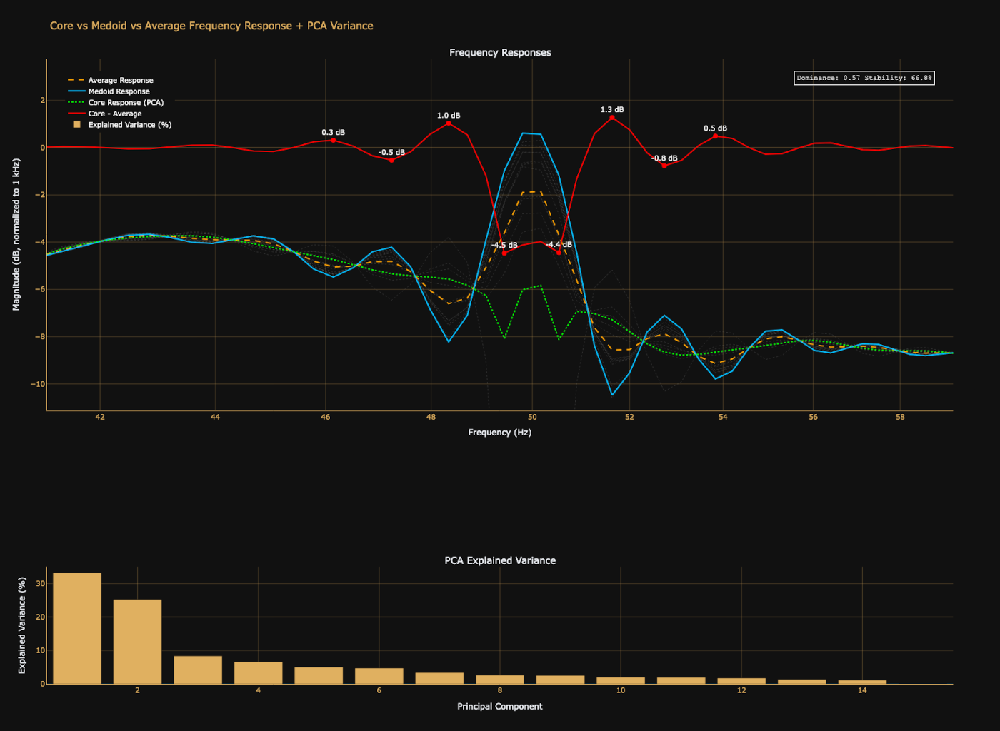

# Core Response

A Python tool for analyzing multiple frequency response measurements and extracting the underlying "core response" using Principal Component Analysis (PCA). Perfect for audio engineers, acousticians, and anyone working with frequency sweep data.

## What It Does

This tool takes multiple frequency response measurements (e.g., from different microphone positions or repeated measurements) and extracts three key representations:

- **Core Response (PCA)**: The dominant frequency response pattern using SVD-based PCA, properly scaled to reflect actual magnitude levels
- **Medoid Response**: The measurement closest to all others (most representative actual measurement)
- **Average Response**: Simple arithmetic mean of all measurements

It also visualizes the explained variance from PCA components and highlights where the core response differs most from the average.

## Why PCA?

**Principal Component Analysis (PCA)** identifies the dominant patterns in your data. When you have multiple frequency response measurements:

- **The Problem**: Individual measurements contain both the true underlying response AND random variations (measurement noise, slight position changes, environmental factors)
- **The Solution**: PCA separates systematic patterns from noise by finding the direction of maximum variance in your data

The first principal component (PC1) captures the largest shared pattern across all measurements—this is your "core response." Higher-order components capture progressively smaller variations and noise.

**Why not just use the average?** The average treats all frequency variations equally. PCA weights the reconstruction by how much each pattern contributes to the overall variance, resulting in a more robust representation that emphasizes consistent features while de-emphasizing random noise.

Think of it as finding the "signal" in the signal-to-noise ratio across your measurement set.

## Features

- 📊 Multiple extraction methods: PCA-based core, medoid, and average
- 📈 Interactive Plotly visualizations with dark theme
- 🔍 Automatic peak detection showing largest deviations
- 📉 PCA variance analysis with dominance and stability metrics
- 💾 CSV export of all results
- 🎯 RMSE comparisons between methods
- 🔧 Automatic 1 kHz normalization

## Installation

```bash
pip install numpy pandas scipy plotly
```

## Usage

```bash
python core_response.py /path/to/measurements/
```

### Input Format

Place your frequency sweep files (CSV or TXT) in a folder. Each file should have two columns:
- Column 1: Frequency (Hz)
- Column 2: Magnitude (dB)

Example:
```
frequency,magnitude
20,45.2
25,46.1
31.5,47.3
...
```

### Options

```bash
python core_response.py /path/to/measurements/ --no-plot  # Skip interactive plot
```

## Output

The tool generates four CSV files in your input folder:

1. `core_response.csv` - PCA-extracted core response
2. `medoid_response.csv` - Most representative measurement
3. `average_response.csv` - Arithmetic mean
4. `core_minus_average.csv` - Difference highlighting systematic deviations

Plus an interactive plot showing:
- All measurements (gray dotted lines)
- Core, medoid, and average responses
- Difference curve with annotated peaks
- PCA explained variance bar chart
- Dominance ratio and stability metrics

## Understanding the Results

**Dominance Ratio**: How much variance PC1 captures vs PC2. Higher (→1.0) means more consistent measurements.

**Stability Index**: Cumulative variance of first 3 PCs. Higher values indicate measurements share common patterns.

**RMSE Values**: Quantifies how different the average and medoid are from the PCA core response.

## Example Visualization

The plot includes:
- Frequency response curves on a log-scale x-axis
- All individual measurements in faint gray
- Core response in lime green
- Medoid in cyan
- Average in orange
- Difference curve in red with peak annotations
- PCA variance breakdown showing component contributions



## Use Cases

- **Equalizer Design**: Use the core response as the source measurement for creating EQ corrections
- Speaker/headphone measurement analysis
- Room acoustics characterization
- Microphone calibration
- Quality control for audio equipment
- Research on frequency response variability
- Identifying systematic room modes or resonances across measurement positions

## Technical Details

The PCA extraction properly:
- Mean-centers the data
- Performs SVD decomposition
- Scales PC1 by its singular value for correct magnitude
- Adds back the mean for accurate dB-level reconstruction

This ensures the core response reflects actual signal levels, not just the shape of variation.

## License

MIT License - feel free to use and modify for your projects.
